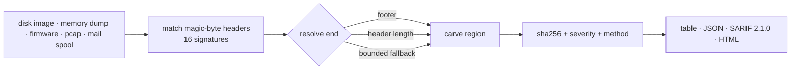

<a name="top"></a>
<div align="center">


# FILECARVE

### Carve embedded files from a blob by magic-byte signatures


[](https://pypi.org/project/cognis-filecarve/) [](https://github.com/cognis-digital/filecarve/actions) [](LICENSE) [](https://github.com/cognis-digital)

*Part of the Cognis Neural Suite.*

</div>

```bash
pip install cognis-filecarve
filecarve scan .            # → prioritized findings in seconds
```

## Usage — step by step

1. **Install** the CLI:

   ```bash
   pipx install "git+https://github.com/cognis-digital/filecarve.git"
   ```

2. **Scan** a blob first to preview carve candidates (writes nothing) — the safe primary command:

   ```bash
   filecarve scan disk.img
   cat disk.img | filecarve scan -          # or read from stdin
   ```

3. **Carve** the embedded files out to a directory, optionally filtering by type and minimum size:

   ```bash
   filecarve carve disk.img -o carved/ --type jpg --type png --min-size 1024
   ```

4. **Read the output** — choose table, JSON, or a shareable HTML report, and write it to a file:

   ```bash
   filecarve --format json scan disk.img > carves.json
   filecarve --format sarif scan disk.img > carves.sarif   # code-scanning / CI
   filecarve --format html -r report.html scan disk.img     # shareable report
   ```

   Global flags also work **after** the subcommand:

   ```bash
   filecarve scan disk.img --format sarif -r carves.sarif
   ```

5. **Automate in a pipeline** — inventory embedded files from an artifact:

   ```bash
   filecarve --format json scan firmware.bin | jq '.[].ext' | sort | uniq -c
   ```

## Contents

- [Why filecarve?](#why) · [Features](#features) · [Quick start](#quick-start) · [Example](#example) · [Demos](#demos) · [Architecture](#architecture) · [AI stack](#ai-stack) · [How it compares](#how-it-compares) · [Integrations](#integrations) · [Install anywhere](#install-anywhere) · [Edge / air-gap](#edge) · [Scope & safety](#scope) · [Related](#related) · [Contributing](#contributing)

<a name="why"></a>
## Why filecarve?

Carve embedded files from a blob by magic-byte signatures — without standing up heavyweight infrastructure.

`filecarve` is single-purpose, scriptable, and self-hostable: point it at a target, get prioritized results in the format your workflow already speaks (table · JSON · SARIF), gate CI on it, and let agents drive it over MCP.

<div align="right"><a href="#top">↑ back to top</a></div>

<a name="features"></a>
## Features

- ✅ **Scan** a blob and list embedded files by magic-byte signature (writes nothing)
- ✅ **Carve** the embedded files out to a directory — byte-exact where the format allows
- ✅ 16 built-in signatures: jpg · png · gif · bmp · pdf · zip/office/jar · gz · rar · 7z · elf · exe · riff (wav/avi/webp) · sqlite · pcap
- ✅ Smart end-detection: **footer**, header-derived **length** (BMP/RIFF/GIF/**ZIP**), or a bounded fallback that flags possible truncation
- ✅ Valid-archive ZIP carving — the full End-Of-Central-Directory record (incl. comment) is included, so carved `.zip`/Office/JAR files re-open cleanly
- ✅ Output as **table · JSON · SARIF 2.1.0 · HTML** — each carve carries an offset, size, SHA-256, severity hint and end-detection method
- ✅ Global flags work **before or after** the subcommand (`--format`, `--type`, `--min-size`, `-r/--report`)
- ✅ Pipeline-friendly exit codes (0 = clean, 1 = findings, 2 = error) + stdin (`-`) support
- ✅ Runs on Linux/macOS/Windows · Docker · devcontainer
- ✅ **Passive / offline by design** — reads only the file (or stdin) you give it; never opens a network socket
- ✅ Carving ports in Python (reference), JavaScript/Node, Go, and Rust under [`ports/`](ports/) — all mirror the `scan` command and the JSON shape, verified byte-for-byte against the demo artifacts

<div align="right"><a href="#top">↑ back to top</a></div>

<a name="quick-start"></a>
## Quick start

```bash
pip install cognis-filecarve
filecarve --version
filecarve scan disk.img                    # preview carve candidates (writes nothing)
filecarve scan disk.img --format json      # machine-readable inventory
filecarve scan disk.img --format sarif      # code-scanning / CI ingestion
filecarve carve disk.img -o carved/         # write the embedded files out
```

> Exit codes are pipeline-friendly: **`0`** = no embedded files found,
> **`1`** = findings present, **`2`** = read/IO error. Gate a CI job on a clean
> acquisition with `filecarve scan artifact && echo OK`.

<div align="right"><a href="#top">↑ back to top</a></div>

<a name="example"></a>
## Example — real output

Carving the committed polyglot demo (a JPEG with a ZIP archive appended — a
classic way to smuggle data past an "it's just a photo" check):

```text
$ filecarve scan demos/07-polyglot-file/photo.jpg
FILECARVE 0.6.6 — source: demos/07-polyglot-file/photo.jpg

  #      OFFSET       SIZE  SEV     METHOD   EXT    NAME
  ----------------------------------------------------------------------
  0  0x00000000        46B  low     footer   jpg    JPEG image
  1  0x0000002e       157B  medium  length   zip    ZIP / Office / JAR

2 file(s) carved  [low=1, medium=1]  (* = bounded/truncated)
```

The same scan as JSON — every carve carries a byte `offset`, `size`, `sha256`,
a `severity` triage hint, and the `method` used to find the file's end
(`footer` · `length` · `bounded`):

```bash
$ filecarve scan demos/07-polyglot-file/photo.jpg --format json
```
```json
{
  "tool": "FILECARVE",
  "version": "0.6.6",
  "source": "demos/07-polyglot-file/photo.jpg",
  "total": 2,
  "severity_counts": { "low": 1, "medium": 1 },
  "findings": [
    { "name": "JPEG image", "ext": "jpg", "offset": 0, "size": 46,
      "sha256": "ad8bfb2b…3114", "severity": "low", "method": "footer", "truncated": false },
    { "name": "ZIP / Office / JAR", "ext": "zip", "offset": 46, "size": 157,
      "sha256": "781a90dc…18ee", "severity": "medium", "method": "length", "truncated": false }
  ]
}
```

The carved `.zip` re-opens cleanly — filecarve includes the full
End-Of-Central-Directory record (and any archive comment), so the extracted
archive is byte-valid, not a corrupt fragment:

```bash
$ filecarve carve demos/07-polyglot-file/photo.jpg -o extracted/
$ unzip -l extracted/00001_0000002e.zip      # the hidden archive, intact
```

<div align="right"><a href="#top">↑ back to top</a></div>

<a name="demos"></a>
## Demos — real-use-case walkthroughs

Each folder under [`demos/`](demos/) ships a **regenerable input artifact** (a
deterministic `make_demo.py`, stdlib-only) plus a `SCENARIO.md` explaining where
the data came from, the exact command to run, what to expect, and how to act on
the findings. All artifacts use real, documented file-format magic bytes — no
fabricated identifiers. Each is verified by the test suite.

| Demo | Scenario | Demonstrates |
|---|---|---|
| [`01-basic`](demos/01-basic/) | Mixed blob with PNG/PDF/ZIP/GZIP concatenated | The fundamentals: scan → carve → report |
| [`04-memory-dump`](demos/04-memory-dump/) | Recover files resident in a process memory dump | PNG + ZIP + inert PE/EXE; severity triage |
| [`05-firmware-image`](demos/05-firmware-image/) | Inventory an IoT/router firmware image | GIF + GZIP + SQLite + ELF across `0xFF` erase-padding |
| [`06-pcap-exfil`](demos/06-pcap-exfil/) | Carve files transferred inside a packet capture | PCAP container + reassembled JPEG & PDF; SARIF out |
| [`07-polyglot-file`](demos/07-polyglot-file/) | Detect a JPEG+ZIP polyglot (hidden archive) | Two regions in one "image"; **valid** extracted zip |
| [`08-unallocated-space`](demos/08-unallocated-space/) | Carve deleted images from unallocated disk space | GIF + BMP, both **length**-resolved (byte-exact) |
| [`09-email-attachments`](demos/09-email-attachments/) | Pull attachments out of a mail spool | Invoice PDF + photo PNG, no MIME parser needed |
| [`10-truncated-tail`](demos/10-truncated-tail/) | Honest handling of a truncated acquisition | Footer-less PNG → `method=bounded`, flagged incomplete |

```bash
# Run any demo end to end
python -m filecarve scan demos/07-polyglot-file/photo.jpg
python -m filecarve carve demos/07-polyglot-file/photo.jpg -o extracted

# Regenerate an artifact deterministically
python demos/07-polyglot-file/make_demo.py
```

> All demos are **defensive / authorized-use** forensics: analyze artifacts you
> own or are authorized to examine.

<div align="right"><a href="#top">↑ back to top</a></div>

<a name="architecture"></a>
## Architecture

`filecarve` is a single-pass, read-only signature carver. For each of the 16
built-in signatures it scans the blob for the magic-byte **header**, then
resolves the file's **end** by the most precise method available — a known
**footer** (JPEG/PNG/PDF), a **length** computed from the file's own header
(BMP/RIFF/GIF/ZIP-EOCD), or a **bounded** fallback that caps the carve and flags
it as possibly truncated. Each region is hashed (SHA-256), severity-tagged, and
emitted as table / JSON / SARIF / HTML.



Nothing in the carve path opens a socket — see [Scope & safety](#scope) below.

<div align="right"><a href="#top">↑ back to top</a></div>

<a name="ai-stack"></a>
## Use it from any AI stack

`filecarve` is interoperable with every popular way of using AI:

- **MCP server** — `filecarve mcp` (Claude Desktop, Cursor, Cognis.Studio, [uncensored-fleet](https://github.com/cognis-digital/uncensored-fleet))
- **OpenAI-compatible / JSON** — pipe `filecarve scan . --format json` into any agent or LLM
- **LangChain · CrewAI · AutoGen · LlamaIndex** — wrap the CLI/JSON as a tool in one line
- **CI / scripts** — exit codes + SARIF for non-AI pipelines

<div align="right"><a href="#top">↑ back to top</a></div>

<a name="how-it-compares"></a>
## How it compares

| | **Cognis filecarve** | typical tools |
|---|:---:|:---:|
| Self-hostable, no account | ✅ | varies |
| Single command, zero config | ✅ | ⚠️ |
| JSON + SARIF for CI | ✅ | varies |
| MCP-native (AI agents) | ✅ | ❌ |
| Polyglot ports (JS/Go/Rust) | ✅ | ❌ |
| Open license | ✅ COCL | varies |
<div align="right"><a href="#top">↑ back to top</a></div>

<a name="integrations"></a>
## Integrations

Pipes into your stack: **SARIF** for code-scanning, **JSON** for anything, an **MCP server** (`filecarve mcp`) for AI agents, and a webhook forwarder for SIEM/Slack/Jira. See [`docs/INTEGRATIONS.md`](docs/INTEGRATIONS.md).

<div align="right"><a href="#top">↑ back to top</a></div>

<a name="install-anywhere"></a>
## Install — every way, every platform

```bash
pip install "git+https://github.com/cognis-digital/filecarve.git"    # pip (works today)
pipx install "git+https://github.com/cognis-digital/filecarve.git"   # isolated CLI
uv tool install "git+https://github.com/cognis-digital/filecarve.git" # uv
pip install cognis-filecarve                                          # PyPI (when published)
docker run --rm ghcr.io/cognis-digital/filecarve:latest --help        # Docker
brew install cognis-digital/tap/filecarve                             # Homebrew tap
curl -fsSL https://raw.githubusercontent.com/cognis-digital/filecarve/main/install.sh | sh
```

| Linux | macOS | Windows | Docker | Cloud |
|---|---|---|---|---|
| `scripts/setup-linux.sh` | `scripts/setup-macos.sh` | `scripts/setup-windows.ps1` | `docker run ghcr.io/cognis-digital/filecarve` | [DEPLOY.md](docs/DEPLOY.md) (AWS/Azure/GCP/k8s) |

<div align="right"><a href="#top">↑ back to top</a></div>

<a name="edge"></a>
## Edge / air-gap

`filecarve` is **stdlib-only** (Python ≥ 3.10) with **no runtime dependencies** —
it drops onto disconnected, field, or classified gear and runs unchanged. The
carve path performs **no network I/O whatsoever**: it reads the artifact (or
stdin), carves in memory, and writes results to disk. The Rust port ships its
own dependency-free SHA-256 so `cargo build` needs no registry access, and the
JS/Go ports use only their standard libraries — so every port builds and runs
air-gapped too.

To move a carving capability into an enclave: copy the repo (or
`pip install .` into a venv) onto removable media, transfer, and run. No feed
refresh, license check, or callback is ever attempted.

> filecarve consumes **no** vulnerability or threat-intelligence feeds — it
> matches file-format magic bytes only — so there is no data DB to refresh and
> nothing goes stale offline.

<div align="right"><a href="#top">↑ back to top</a></div>

<a name="scope"></a>
## Scope & safety

- **Defensive / authorized-use forensics only.** Carve artifacts you own or are
  explicitly authorized to examine (your own disk images, memory dumps, firmware,
  captures, mail spools, incident-response evidence).
- **Passive and read-only.** filecarve never modifies the input, never performs
  active scanning, and never opens a network socket. There are no exploit
  payloads, no auth-bypass logic, and no "attack" surface — it is a parser.
- **No fabricated identifiers.** Every signature is a real, publicly-documented
  file-format magic-byte sequence; demo artifacts are generated deterministically
  by their `make_demo.py` from those real magic bytes (no invented CVEs, hashes,
  or fingerprints).
- **Honest truncation.** When a file's end can't be determined from a footer or
  header length, filecarve uses a bounded fallback and flags the carve
  `truncated` rather than guessing — so downstream analysts aren't misled.

<div align="right"><a href="#top">↑ back to top</a></div>

<a name="related"></a>
## Related Cognis tools


**Explore the suite →** [🗂️ all 170+ tools](https://github.com/cognis-digital/cognis-neural-suite) · [⭐ awesome-cognis](https://github.com/cognis-digital/awesome-cognis) · [🔗 cognis-sources](https://github.com/cognis-digital/cognis-sources) · [🤖 uncensored-fleet](https://github.com/cognis-digital/uncensored-fleet) · [🧠 engram](https://github.com/cognis-digital/engram)

<div align="right"><a href="#top">↑ back to top</a></div>

<a name="contributing"></a>
## Contributing

PRs, new rules, and demo scenarios are welcome under the collaboration-pull model — see [CONTRIBUTING.md](CONTRIBUTING.md) and [SECURITY.md](SECURITY.md).

> ### ⭐ If `filecarve` saved you time, **star it** — it genuinely helps others find it.

## Interoperability

`filecarve` composes with the 300+ tool Cognis suite — JSON in/out and a shared
OpenAI-compatible `/v1` backbone. See **[INTEROP.md](INTEROP.md)** for the
suite map, composition patterns, and reference stacks.

## License

Source-available under the **Cognis Open Collaboration License (COCL) v1.0** — free for personal, internal-evaluation, research, and educational use; **commercial / production use requires a license** (licensing@cognis.digital). See [LICENSE](LICENSE).

---

<div align="center"><sub><b><a href="https://cognis.digital">Cognis Digital</a></b> · one of 170+ tools in the <a href="https://github.com/cognis-digital/cognis-neural-suite">Cognis Neural Suite</a> · <i>Making Tomorrow Better Today</i></sub></div>
